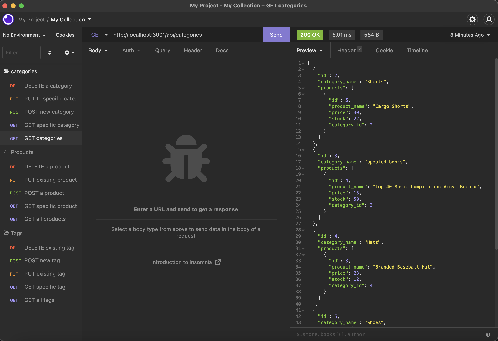
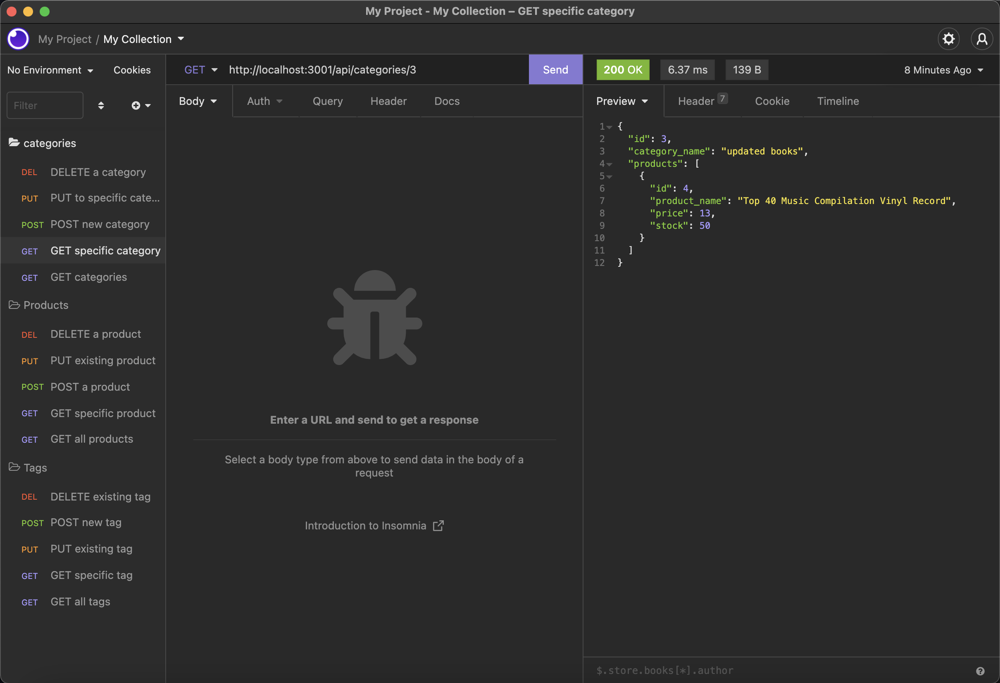
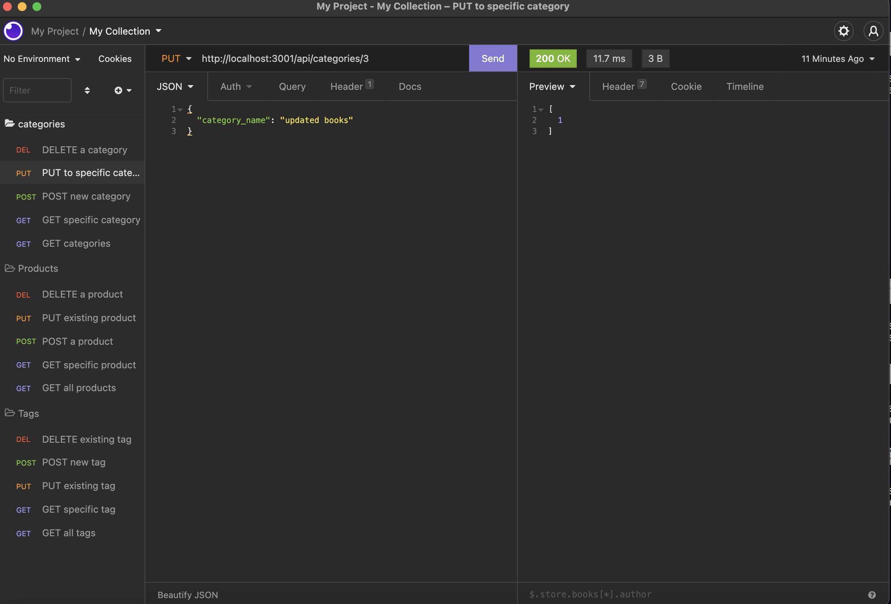
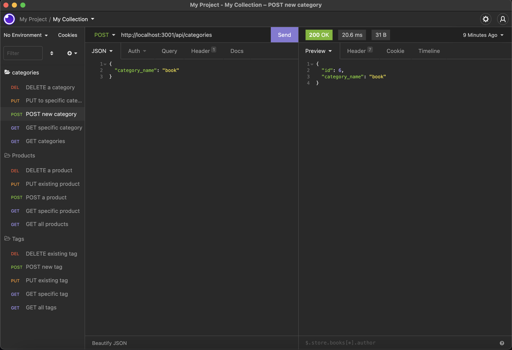
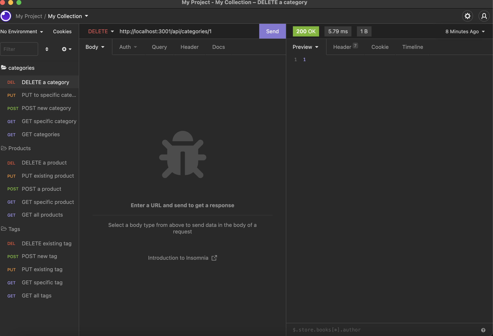

# E-Commerce-backend

## License

[](https://opensource.org/licenses/MIT)

https://opensource.org/licenses/MIT


## Table of Contents
* [Description](#description) 
* [User Story & Criteria](#userstory)
* [Installation Instructions](#installation)
* [Usage Instructions](#usage)
* [Contribution Guide](#contribute)
* [Tests](#tests)
* [Questions](#questions)


## Description
This project is an E-Commerce backend built in node js using sequelize as a database and express router to build the API that returns the data to the user in JSON form. The application allows users to interact with a hypothetical stores inventory system including categories which products belong to, the products themselves, including the name, price, stock and which category it belongs to. Finally, the app allows users to interact with the tags associated with the products. The features that users have access to are as follows:

* Getting the list of categories, products or tags,
* Getting a specific category, product or tag,
* Changing information in a specific category, product or tag,
* deleting a specific category, product or tag

This fulfils all of the technical acceptance criteria.

In insomnia, the requests and responses are as follows:


* Getting all items at a given endpoint:


    The response here is the entire contents of the database table that has been targeted


* Getting a single item at a given endpoint:


    The response here is the content of the database table that matches to the id at the end of the request as a paramater.


* Changing an item at a given endpoint:



* Posting (adding) an item to a given endpoint:


    The response here is the effected item in the database.


* Deleting an item at a given endpoint:


    The response here is the effected item in the database.


### Video Demo
A video demonstation of the app can be viewed here: https://drive.google.com/file/d/13IXmaQKl5LfysSbvpTDhN6DGJ9-AaFza/view


## User Story

```md
AS A manager at an internet retail company
I WANT a back end for my e-commerce website that uses the latest technologies
SO THAT my company can compete with other e-commerce companies
```

## Acceptance Criteria

```md
GIVEN a functional Express.js API
WHEN I add my database name, MySQL username, and MySQL password to an environment variable file
THEN I am able to connect to a database using Sequelize
WHEN I enter schema and seed commands
THEN a development database is created and is seeded with test data
WHEN I enter the command to invoke the application
THEN my server is started and the Sequelize models are synced to the MySQL database
WHEN I open API GET routes in Insomnia for categories, products, or tags
THEN the data for each of these routes is displayed in a formatted JSON
WHEN I test API POST, PUT, and DELETE routes in Insomnia
THEN I am able to successfully create, update, and delete data in my database
```


## Installation
To Install and run this application yourself, follow the step(s) below:
 ```npm i```


## Usage
install the applicaiton dependancies using the above command, initialize the database in mysql by running `mysql -u <user> -p <password>`. Then, `source db/schema.sql`. The mysql interface can be exited using the command `exit` and seeding the database can take place using the command `node seeds/index`. Now that the database is initialized and seeded, run `npm start` to run the application and open the url in insomnia to interact with the api as you wish.


## Contribute
This app has been finished and does not require any further development.


## Tests
This app does not have any tests.


## Questions
For any questions about the code please see my github for source code, email me at the address provided, or find my social media links on my portfolio website. 
* https://github.com/EvanCWoods
* evan.woods.dev@gmail.com
* https://evan-woods-portfolio.herokuapp.com/
